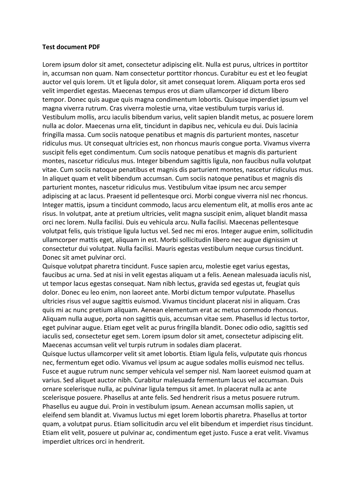

# pdf2readme
A simple Github Action that converts a PDF file into JPEG images and seamlessy update your repository's README to showcase these images. 

## How to use:
- Copy the folder ***".github/workflows"*** and its contents into your Github repository.
- Make sure that inside your repository there is a ***README.md*** file (you can just create a blank one) and the .pdf you want to convert.
- Modify ***.github/workflows/pdf2readme.yml*** to point to your .pdf file *(line 25)*.
- Trigger the action by using the ***"Run workflow"*** button on the ***"Actions"*** tab.

## Credits:
- This project is based on [PDFWriteupReadme](https://github.com/contagon/PDFWriteupReadme/tree/master) (apparently discontinued) by [contagon](https://github.com/contagon), which used ***ImageMagick*** instead of ***Poppler***, among other differences. 

## Example:

